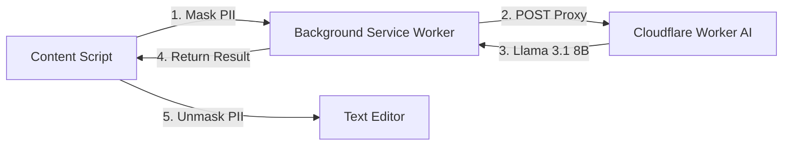

<div align="center">

<!-- PROJECT LOGO / BANNER -->

<br/>
<br/>

# Tonal

### The two-way tone translator for the modern web.

<br/>

<!-- BADGES -->
[](https://javascript.info)
[](LICENSE)
[](https://chrome.google.com/webstore)
[](https://workers.cloudflare.com/)

<br/>

<!-- QUICK NAVIGATION LINKS -->
[📖 Docs](#-features) · [🚀 Quickstart](#-quickstart) · [🐛 Report Bug](https://github.com/kwakhare5/Tonal/issues) · [💡 Request Feature](https://github.com/kwakhare5/Tonal/issues)

</div>

---

## 🧩 What is Tonal?

Tonal is a **two-way AI tone translator** Chrome extension built with **Vanilla JS** and powered by **Groq AI (Llama 3.3 70B)**.

It was created to solve **the friction of modern digital communication**. Whether you need to turn a quick "k thanks" into a polished professional response, or you need to "decode" a passive-aggressive corporate email into plain English, Tonal handles it directly inside your chat box. Unlike existing solutions that require expensive subscriptions or clunky copy-pasting, Tonal uses a **Privacy-First AI Pill** that lives right where you type.

---

## ✅ Features

- ✅ **One-Click Conversion** — Instantly shift between Casual (Texting), Friendly (Work Chat), and Formal (Corporate).
- ✅ **The Decoder** — Translate corporate jargon and passive-aggressive "Manager-speak" into blunt, plain English.
- ✅ **Zero-Key Security** — No API keys required from the user. Powered by a secure Cloudflare Worker.
- ✅ **Privacy-First (Local Masking)** — Automatically redacts PII (emails/phones) locally before AI processing and restores them instantly.
- ✅ **Ghost-Free Injection** — Uses native browser commands to work seamlessly on Gmail, LinkedIn, Slack, and WhatsApp.
- ✅ **Apple-Grade Motion** — High-fidelity transitions and glassmorphic materials for a premium experience.

---

## 🏗️ Architecture



---

## 🚀 Quickstart

### Prerequisites

- A modern browser (Chrome, Edge, or Brave).
- A Cloudflare account (for hosting your own AI proxy).

### Installation

```bash
# 1. Clone the repo
git clone https://github.com/kwakhare5/Tonal.git
cd Tonal

# 2. Open Chrome Extensions
# Visit chrome://extensions/

# 3. Enable Developer Mode
# Click the toggle in the top-right corner.

# 4. Load Unpacked
# Select the 'Tonal' folder.
```

### Configuration (AI Backend)

1. Deploy the `worker.js` file to your **Cloudflare Workers** account: `npm run deploy`.
2. Copy your Worker's URL (e.g., `https://tonal-proxy.name.workers.dev`).
3. Open `background.js` and paste your URL into the `WORKER_URL` constant.
4. Load the extension in Chrome (Developer Mode → Load Unpacked).
5. Open Gmail, Slack, or LinkedIn and start typing!

---

## 📁 Project Structure

```
tonal/
├── manifest.json                # Extension config & permissions
├── background.js                # AI proxy bridge & messaging
├── content.js                   # UI injection & input detection
├── worker.js                    # Cloudflare AI logic (Llama 3.1)
├── styles.css                   # Premium UI design system
├── popup.html/js                # Settings & Offset controls
├── icons/                       # Brand assets
└── README.md
```

---

## 👤 Author

**Karan Wakhare**

[](https://github.com/kwakhare5)
[](https://linkedin.com/in/kwakhare5)

---

<div align="center">
  <sub>Built with ❤️ for the modern communicator. If this helped you, consider giving it a ⭐!</sub>
</div>
