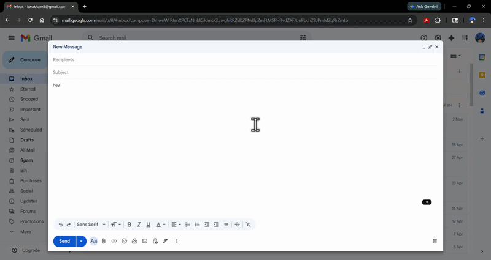
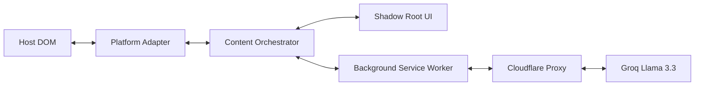

<!-- ╔══════════════════════════════════════════════════════════════════╗
     ║          Tonal — README                                             ║
     ║          Precision Tone Translation for Gmail, Slack, & LinkedIn    ║
     ╚══════════════════════════════════════════════════════════════════╝ -->

<div align="center">

  
  <br/>

  # Tonal

  ### *The two-way tone translator for elite professional communication.*

  <br/>

  
  
  
  
  

  <br/>

  <a href="#-about-the-project">About</a> &nbsp;·&nbsp;
  <a href="#-demo">Demo</a> &nbsp;·&nbsp;
  <a href="#-features">Features</a> &nbsp;·&nbsp;
  <a href="#-tech-stack">Tech Stack</a> &nbsp;·&nbsp;
  <a href="#-quickstart">Quickstart</a> &nbsp;·&nbsp;
  <a href="#-contributing">Contributing</a> &nbsp;·&nbsp;
  <a href="#-author">Author</a>

</div>

---

## 🎬 Demo

<div align="center">
  
</div>

<br/>

> 🎨 **Interactive Visual spec**: You can preview and test all floating pill states, popover menus, and toasts in the standalone, light-mode **[extension_demo.html](extension_demo.html)** page directly in your browser.

<br/>

---

## 📌 About the Project

**Tonal** is a **zero-dependency Chrome extension** built with **Vanilla JavaScript (Manifest V3)**.

Tonal solves the friction of switching between casual drafts and professional execution. Powered by Groq Llama 3.3 70B, it provides high-fidelity, preamble-free rephrasing inside Gmail, Slack, and LinkedIn.

> **Why this project?**
> Most professional friction comes from tone mismatch. Tonal bridges that gap instantly.

<br/>

---

## ✨ Features

| Status | Feature | Description |
|:---:|---|---|
| ✅ | **Precision Sending** | Convert casual drafts to Formal Professional or Work Chat instantly. |
| ✅ | **Blunt Decoding** | Highlight jargon and get a plain English explanation in a magnetic viewport card. |
| ✅ | **1.5s Watchdog** | A heartbeat loop ensures the UI persists through complex React/Lexical re-renders. |
| ✅ | **Identity Lock** | AI engine preserves names, dates, emails, and numbers as immutable constants. |
| ✅ | **Platform Adapters** | Custom DOM synchronization for Gmail, Slack, and LinkedIn to prevent cursor drift. |

<br/>

---

## 🛠️ Tech Stack

<div align="center">

### Core


### Infrastructure


</div>

<br/>

| Layer | Technology | Purpose |
|---|---|---|
| **Language** | Vanilla JS | Zero-dependency, lightweight runtime |
| **Framework** | Manifest V3 | Chrome Extension architecture |
| **Styling** | Shadow DOM CSS | Zero leakage to/from host pages |
| **API / Engine** | Groq Llama 3.3 | 70B parameter high-fidelity rephrasing |
| **Deployment** | Cloudflare Workers | Secure, serverless API routing |

<br/>

---

## 🏗️ Architecture



<br/>

---

## 📁 Project Structure

```
Tonal/
├── backend/                     # Cloudflare Worker proxy backend
│   ├── src/index.js             # Worker router & LLM orchestrator
│   └── wrangler.toml            # Cloudflare Wrangler config
│
├── extension/                   # Manifest V3 Chrome Extension
│   ├── manifest.json            # Extension manifest config
│   ├── background.js            # Background service worker
│   ├── content.js               # Target input orchestrator & watchdog
│   ├── popup.html / popup.js    # Browser action settings popup
│   ├── core/
│   │   ├── tonal.js             # Shared DOM builder & state controller
│   │   └── tonal.css            # Isolated Shadow DOM styles & custom animations
│   ├── adapters/                # Custom platform sync handlers
│   └── icons/                   # Brand logo assets (icon128.png, etc.)
│
├── website/                     # Next.js homepage & interactive mockup
│   ├── src/app/page.tsx         # Landing page with scroll animations
│   └── public/icons/            # Unified brand icons
│
├── extension_demo.html          # Standalone Light-Mode UI States Playground
└── README.md
```

<br/>

---

## 🚀 Quickstart

### Prerequisites

- **Google Chrome** — Or any Chromium-based browser
- **Developer Mode** — Enabled in chrome://extensions/

<br/>

### Step 1 — Clone

```bash
git clone https://github.com/kwakhare5/Tonal.git
cd Tonal
```

### Step 2 — Load Unpacked

Open chrome://extensions/, toggle Developer mode, and click Load unpacked selecting the Tonal folder.

```bash
chrome://extensions/
```

### Step 3 — Configure Preferences

Click the Tonal Icon, select your default tone level, and settings will sync instantly.

```bash
# UI Interaction
```

<br/>

---

## 🤝 Contributing

1. **Fork** the repository
2. **Create** your feature branch (`git checkout -b feature/your-feature`)
3. **Commit** using [Conventional Commits](https://www.conventionalcommits.org/) (`git commit -m "feat: add your feature"`)
4. **Push** (`git push origin feature/your-feature`)
5. **Open a Pull Request**

<br/>

---

## 🛡️ Privacy & Security

> Tonal is a stateless utility. No message data is ever stored on our servers. Requests are processed in real-time by Groq Llama 3.3 and discarded immediately.

<br/>

---

## 📄 License

Distributed under the **MIT License**. See `LICENSE` for the full text.

<br/>

---

## 👨‍💻 Author

<div align="center">

### Karan Wakhare
*Full Stack Engineer*

<br/>

[](https://www.linkedin.com/in/karanwakhare)
[](https://x.com/kwakhare5)
[](mailto:kwakhare5@gmail.com)
[](https://github.com/kwakhare5)

<br/>


<br/>


</div>

<br/>

---

<div align="center">

  Made with ❤️ by [Karan Wakhare](https://github.com/kwakhare5)

  <br/>

  *"First, solve the problem. Then, write the code."*

  <br/>

  

</div>

