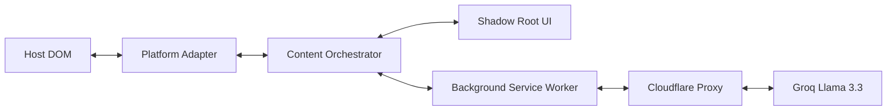

<!-- ╔══════════════════════════════════════════════════════════════════╗
     ║               TONAL — ELITE README DOCUMENTATION                ║
     ║   Precision Tone Translation for Gmail, Slack, & LinkedIn      ║
     ╚══════════════════════════════════════════════════════════════════╝ -->

<!-- ═══════════════════════════ HERO SECTION ═══════════════════════════ -->

<div align="center">

  

  <br/>

  # Tonal


  ### *The two-way tone translator for elite professional communication.*

  <br/>
  <br/>

  <!-- ── STATUS BADGES ── -->

  
  
  
  
  
  

  <br/>

  <!-- ── QUICK NAVIGATION ── -->
  <a href="#-about-the-project">About</a> &nbsp;·&nbsp;
  <a href="#🎬-demo">Demo</a> &nbsp;·&nbsp;
  <a href="#-features">Features</a> &nbsp;·&nbsp;
  <a href="#-tech-stack">Tech Stack</a> &nbsp;·&nbsp;
  <a href="#-quickstart">Quickstart</a> &nbsp;·&nbsp;
  <a href="#-roadmap">Roadmap</a> &nbsp;·&nbsp;
  <a href="#-contributing">Contributing</a> &nbsp;·&nbsp;
  <a href="#-about-the-author">Author</a>

</div>

---

<!-- ════════════════════════════ DEMO ════════════════════════════ -->

## 🎬 Demo

<div align="center">
  
</div>

<br/>

<div align="center">

| 🖥️ Extension | 📹 Platform Support | 📄 Architecture |
|:---:|:---:|:---:|
| [Chrome Store](#) | [Gmail / Slack / LinkedIn](#) | [Shadow DOM Isolation](#) |

</div>

<br/>

---

<!-- ════════════════════════════ ABOUT ════════════════════════════ -->

## 📌 About the Project

**Tonal** is a **zero-dependency Chrome extension** built with **Vanilla JavaScript (Manifest V3)** and **Shadow DOM isolation**.

It was created to solve the friction of switching between casual drafts and professional execution, as well as the confusion of parsing jargon-heavy messages. Unlike existing solutions that clutter your UI with bloat, Tonal uses a precision, non-intrusive architecture powered by **Groq Llama 3.3 70B** for high-fidelity, preamble-free rephrasing.

> **Why this project?**
> Most professional friction comes from tone mismatch. Whether you're too blunt in an email or confused by a corporate jargon-bomb, Tonal bridges the gap instantly.

<br/>

---

<!-- ════════════════════════════ FEATURES ════════════════════════════ -->

## ✨ Features

| Status | Feature | Description |
|:---:|---|---|
| ✅ | **Precision Sending** | Convert casual drafts to Formal Professional or Work Chat instantly. |
| ✅ | **Blunt Decoding** | Highlight jargon and get a plain English explanation in a magnetic viewport card. |
| ✅ | **1.5s Watchdog** | A heartbeat loop ensures the UI persists through complex React/Lexical re-renders. |
| ✅ | **Identity Lock** | AI engine preserves names, dates, emails, and numbers as immutable constants. |
| ✅ | **Platform Adapters** | Custom DOM synchronization for Gmail, Slack, and LinkedIn to prevent cursor drift. |


<br/>

---

<!-- ════════════════════════════ TECH STACK ════════════════════════════ -->

## 🛠️ Tech Stack

<div align="center">

### Core


### Infrastructure


</div>

<br/>

| Layer | Technology | Purpose |
|---|---|---|
| **Language** | Vanilla JS | Zero-dependency, lightweight runtime |
| **Framework** | Manifest V3 | Chrome Extension architecture |
| **Styling** | Shadow DOM CSS | Zero leakage to/from host pages |
| **AI Engine** | Groq Llama 3.3 | 70B parameter high-fidelity rephrasing |
| **Proxy** | Cloudflare Workers | Secure, serverless API routing |
| **Typography** | Geist | Elite, high-status professional font |

<br/>

---

<!-- ════════════════════════════ ARCHITECTURE ════════════════════════════ -->

## 🏗️ Architecture



<br/>

---

<!-- ════════════════════════════ PROJECT STRUCTURE ════════════════════════ -->

## 📁 Project Structure

```
Tonal/
│
├── manifest.json                # Extension configuration (MV3)
├── src/
│   ├── core/
│   │   └── tonal.js             # Design System tokens & classes
│   └── extension/
│       ├── adapters/            # Platform-specific (Gmail/Slack/LinkedIn)
│       ├── background.js        # Service worker (Proxy handler)
│       ├── content.js           # Injection & Watchdog engine
│       └── popup.js             # Settings & preference logic
│
├── design/                      # Tonal Design System source
├── icons/                       # Branding & UI assets
└── README.md
```

<br/>

---

<!-- ════════════════════════════ QUICKSTART ════════════════════════════ -->

## 🚀 Quickstart

### Prerequisites

Before you begin, make sure you have the following installed:

- **Google Chrome** (or any Chromium-based browser)
- **Developer Mode** enabled in `chrome://extensions/`

<br/>

### Step 1 — Clone the Repository

```bash
git clone https://github.com/kwakhare5/Tonal.git
cd Tonal
```

### Step 2 — Load Unpacked

1. Open `chrome://extensions/` in your browser.
2. Toggle **Developer mode** (top right).
3. Click **Load unpacked** and select the `Tonal` folder.

### Step 3 — Configure Preferences

1. Click the **Tonal Icon** in your extension bar.
2. Select your default tone level (Casual, Work, or Formal).
3. Your settings will sync across all active tabs instantly.

<br/>

---

<!-- ════════════════════════════ ROADMAP ════════════════════════════ -->

## 🗺️ Roadmap

### v1.0 — Foundation *(current)*
- [x] Absolute Shadow DOM isolation
- [x] 1.5s Heartbeat Watchdog for persistence
- [x] Gmail, Slack, and LinkedIn adapters


<br/>

---

<!-- ════════════════════════════ CONTRIBUTING ════════════════════════════ -->

## 🤝 Contributing

1. **Fork** the repository
2. **Create** your feature branch (`git checkout -b feature/amazing-feature`)
3. **Commit** your changes using [Conventional Commits](https://www.conventionalcommits.org/)
4. **Push** to the branch (`git push origin feature/amazing-feature`)
5. **Open a Pull Request**

<br/>

---

<!-- ════════════════════════════ DISCLAIMER ════════════════════════════ -->

## 🛡️ Privacy & Security

> **Tonal is a stateless utility.** No message data is ever stored on our servers. Requests are processed in real-time by Groq Llama 3.3 and discarded immediately. Tonal does not track your browsing history or access data outside of the supported messaging platforms.

<br/>

---

<!-- ════════════════════════════ LICENSE ════════════════════════════ -->

## 📄 License

Distributed under the **MIT License**. See `LICENSE` for the full text.

<br/>

---

<!-- ════════════════════════════ ABOUT THE AUTHOR ════════════════════════ -->

## 👨‍💻 About the Author

<div align="center">

### Karan Wakhare


</div>

<br/>

---

<!-- ════════════════════════════ LET'S CONNECT ════════════════════════════ -->

## 🌐 Let's Connect

<div align="center">

[](https://github.com/kwakhare5)
[](https://linkedin.com/in/karanwakhare)

<br/>


</div>

<br/>

---

<div align="center">

  Made with ❤️ by [Karan Wakhare](https://github.com/kwakhare5)

  <br/>

  *"First, solve the problem. Then, write the code."*

  <br/>

  

</div>
