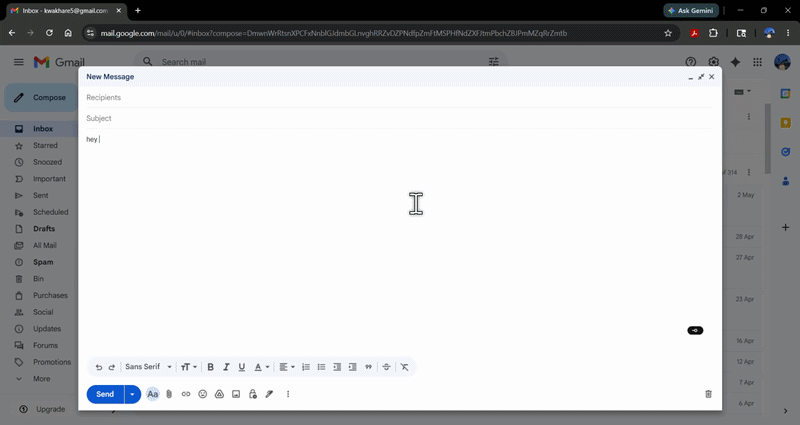
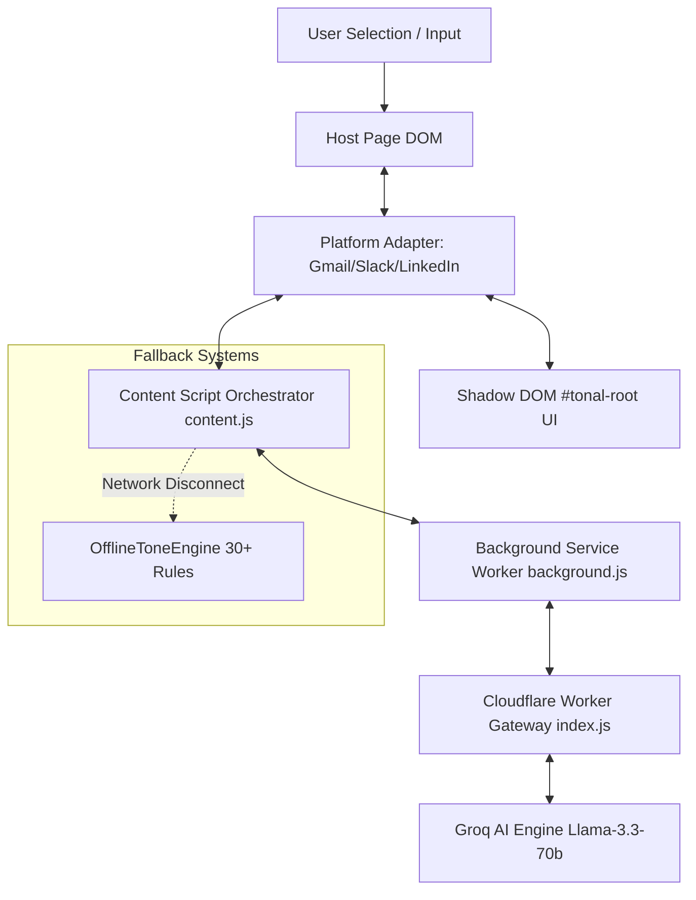

<!-- ╔══════════════════════════════════════════════════════════════════╗
     ║          tonal — README                                             ║
     ║          Precision Tone Translation for Gmail, Slack, & LinkedIn    ║
     ╚══════════════════════════════════════════════════════════════════╝ -->

<div align="center">

  
  <br/>

  # tonal

  ### *The two-way tone translator for elite professional communication.*

  <br/>

  
  
  
  
  

  <br/>

  <a href="#-about-the-project">About</a> &nbsp;·&nbsp;
  <a href="#-demo">Demo</a> &nbsp;·&nbsp;
  <a href="#-features">Features</a> &nbsp;·&nbsp;
  <a href="#-tech-stack">Tech Stack</a> &nbsp;·&nbsp;
  <a href="#-architecture">Architecture</a> &nbsp;·&nbsp;
  <a href="#-quickstart">Quickstart</a> &nbsp;·&nbsp;
  <a href="#-security--privacy">Security</a> &nbsp;·&nbsp;
  <a href="#-author">Author</a>

</div>

---

## 🎬 Demo

<div align="center">
  
</div>

<br/>

> 🎨 **Interactive Visual Spec**: Preview all floating pill states, popover menus, decode cards, and toasts in the standalone **[extension/ui-spec.html](extension/ui-spec.html)** specification playground directly in your browser.

<br/>

---

## 📌 About the Project

**tonal** is a **zero-dependency Chrome Extension (Manifest V3)** paired with a **serverless AI edge gateway** and a **Next.js 16 Web Application**.

tonal eliminates the friction of switching between casual drafts and professional execution. Powered by Groq (Llama 3.3 70B), it provides high-fidelity, preamble-free tone transformation inside Gmail, Slack, and LinkedIn.

> **Why tonal?**  
> Most professional friction comes from tone mismatch. tonal bridges that gap instantly with 100% preservation of facts, names, dates, links, and amounts.

<br/>

---

## ✨ Features Matrix

| Feature | Description | Status |
|:---|:---|:---:|
| **Precision Tone Shifting** | Convert casual drafts to **Formal Professional** or **Work Chat** instantly without conversational fluff. | 🟢 Live |
| **Rule 9: Exact Information Equivalence** | AI engine guarantees 100% preservation of dates, names, links, amounts, and conditions typed by the user. | 🟢 Live |
| **Blunt Corporate Decoder** | Highlight jargon ("synergy", "circle back", "bandwidth") to get plain English translations in a glassmorphic card. | 🟢 Live |
| **Shadow DOM Isolation** | All UI elements reside inside `#tonal-root` Shadow DOM, ensuring zero host-page CSS pollution. | 🟢 Live |
| **Magnetic Cursor Physics** | RequestAnimationFrame physics engine (`MagnetPhysics`) tracks mouse position within a 40px radius for gentle pull. | 🟢 Live |
| **Keyboard Shortcut** | Press `Ctrl+Shift+T` (Mac: `Cmd+Shift+T`) to activate the tone popover on any focused text input. | 🟢 Live |
| **Per-Site Tone Memory** | Remembers default tone per domain (`mail.google.com` → Formal, `slack.com` → Work Chat) in `chrome.storage.local`. | 🟢 Live |
| **Persistent Undo History** | Saves the last 10 rewrites with timestamps. Restores original draft even after page reloads. | 🟢 Live |
| **Offline Fallback Engine** | Built-in `OfflineToneEngine` — 30+ regex word-swap rules per tone. Works with zero network connectivity. | 🟢 Live |
| **Platform Adapters** | Custom DOM adapters (`gmail.js`, `slack.js`, `linkedin.js`) preventing cursor drift in Lexical/Draft.js editors. | 🟢 Live |
| **A/B Growth Tracking** | Integrated experiment tracking on landing page CTA (`DownloadButton.tsx`) to measure install conversion. | 🟢 Live |
| **Security Shield** | 4,000-character input cap, strict CORS origin checks, and security headers (`nosniff`, `DENY`). | 🟢 Live |

<br/>

---

## 🛠️ Tech Stack

| Layer | Technology | Purpose |
|---|---|---|
| **Extension Runtime** | Vanilla JS (MV3) | Zero-dependency, lightweight Chrome Extension runtime |
| **UI Isolation** | Shadow DOM CSS (`core/tonal.css`) | Encapsulated styling preventing host page CSS bleed |
| **Cloud AI Gateway** | Cloudflare Workers & Groq | Serverless API routing with Llama 3.3 70B parameter model |
| **Web Application** | Next.js 16 (App Router + Turbopack) | Interactive landing page, component playground, and zip bundler |
| **Testing Suite** | Node.js Test Runner | 34 automated unit, integration, and security edge-case tests |

<br/>

---

## 🏗️ Architecture & Data Flow


```mermaid
flowchart TD
    A["User Selection / Input"] --> B["Host Page DOM"]
    B <--> C["Platform Adapter: Gmail/Slack/LinkedIn"]
    C <--> D["Shadow DOM #tonal-root UI"]
    C <--> E["Content Script Orchestrator content.js"]
    E <--> F["Background Service Worker background.js"]
    F <--> G["Cloudflare Worker Gateway index.js"]
    G <--> H["Groq AI Engine Llama-3.3-70b"]

    subgraph Fallback Systems
        E -.->|Network Disconnect| I["OfflineToneEngine 30+ Rules"]
    end
```

<br/>

---

## 📁 Subsystem Directory Structure

```
tonal/
├── backend/                     # Cloudflare Worker proxy backend
│   ├── src/index.js             # Worker router, LLM orchestrator & Rule 9 engine
│   ├── tests/                   # 34 deep inside-out unit test files
│   └── wrangler.toml            # Cloudflare Wrangler deployment config
│
├── extension/                   # Manifest V3 Chrome Extension
│   ├── manifest.json            # Extension manifest config & host_permissions
│   ├── background.js            # Background service worker (API gateway communication)
│   ├── content.js               # Content orchestrator, MagnetPhysics & watchdog
│   ├── popup.html / popup.js    # 280px popup control panel
│   ├── core/
│   │   ├── tonal.js             # Core DOM builder & state controller
│   │   └── tonal.css            # Dynamic Shadow DOM styles & custom animations
│   ├── adapters/                # DOM adapters (gmail.js, slack.js, linkedin.js)
│   └── ui-spec.html             # Visual spec playground for component states
│
├── website/                     # Next.js 16 website & interactive mockup
│   ├── src/app/page.tsx         # Hero page with scroll animations
│   ├── src/components/          # TonalMockup, ArchitectureSection, DownloadButton
│   └── public/                  # Static assets & tonal-extension.zip package
│
├── ARCHITECTURE.md              # Deep technical architecture reference
├── CONTEXT.md                   # Domain terminology & entity mappings
├── CLAUDE.md                    # Project development guidelines & session resume
└── README.md
```

<br/>

---

## 🚀 Quickstart & Local Development

### Prerequisites

- **Google Chrome** — Or any Chromium-based browser (Brave, Edge)
- **Node.js** — `v18.0.0` or higher

<br/>

### 1. Load Extension in Chrome

1. Open `chrome://extensions/` in Chrome.
2. Toggle **Developer mode** in the top-right corner.
3. Click **Load unpacked** and select the `/extension` directory in this repository.

<br/>

### 2. Run Landing Page Web App

```bash
# Navigate to website directory
cd website

# Install dependencies
npm install

# Start local dev server (runs on http://localhost:3000)
npm run dev
```

<br/>

### 3. Run Automated Test Suite

```bash
# Run 34 deep inside-out tests from root directory
npm test
```

<br/>

---

## 🔒 Security & Privacy Audit

1. **API Key Protection**: The Groq API key is stored strictly inside the Cloudflare Worker environment variables. Content and background scripts never touch the key.
2. **CORS Origin Filtering**: Worker verifies the `Origin` header against `chrome-extension://`, `localhost`, and `tonall.pages.dev`.
3. **Input Length Cap**: Enforces a 4,000-character ceiling per request (`MAX_INPUT_LENGTH`).
4. **Prompt Injection Defense**: Input text is wrapped inside `<input_data>` XML tags to prevent breakout attacks.
5. **Response Headers**: Returns `X-Content-Type-Options: nosniff` and `X-Frame-Options: DENY`.

<br/>

---

## 📄 License & Author

Distributed under the MIT License. See `LICENSE` for details.

Developed with precision by **Karan Wakhare** ([@kwakhare5](https://github.com/kwakhare5)).
